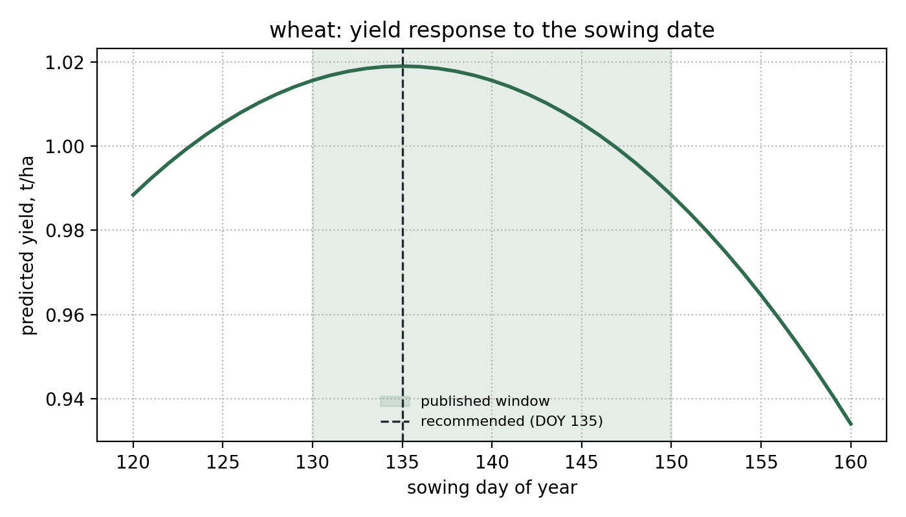

# agroclim

[](https://github.com/Choppa2077/agroclim-kz/actions/workflows/ci.yml)
[](https://www.python.org/)
[](LICENSE)
[](https://docs.astral.sh/ruff/)

Planting-date decision support for rainfed crops in Northern Kazakhstan.

`agroclim` turns open weather and soil data into an **explainable sowing-date
recommendation** for six crops — wheat, barley, pea, lentil, canola and flax.
It is the reproducible core of a master's dissertation at Astana IT University
and implements the agronomic model published in:

> M. Idrissov, N. Kashkimbayeva, D. Kaibassova. *Determining the Optimal
> Planting Time for Agricultural Crops in Northern Kazakhstan.* IEEE SIST 2026.

Growing-season precipitation explains most of the yield variance in the region
(49 % of the Random Forest feature importance in the paper), but the sowing
date is one of the few variables a farmer actually controls. This tool makes
that trade-off explicit and auditable: every number it prints can be traced
back to one factor of a published formula.

---

## Why a formula and not the trained model

The paper compares eight regression algorithms; tree-based models reach
R² = 0.91–0.92 on the synthetic training set, but the externally validated
score against 21 years of official district yields is R² = 0.289, and the
formula alone reaches 0.374 on the same years. For a small, open and
inspectable tool the transparent formula is therefore both **more accurate on
real data** and explainable, so it is what this package ships. The trained
model stays in the research repository and will enter here behind the same
interface once it beats the formula out of sample.

## Installation

```bash
python -m pip install "git+https://github.com/Choppa2077/agroclim-kz.git"
# with the optional plotting extra
python -m pip install "agroclim[plot] @ git+https://github.com/Choppa2077/agroclim-kz.git"
```

The core package has **no third-party dependencies** — only the Python
standard library — so it installs in seconds and runs anywhere Python 3.10+ runs.

## Quick start

Summarise a growing season from daily weather:

```console
$ agroclim features examples/sample_season.csv
days in season          123
mean temperature        16.10 C
total precipitation     139.2 mm
mean relative humidity  53.4 %
growing degree-days     1981
```

Recommend a sowing date for wheat after a pea predecessor:

```console
$ agroclim recommend --crop wheat --previous pea --precipitation 139 --humidity 55 --year 2027
wheat: sow on 15 May 2027 (day 135)
  expected yield 1.02 t/ha (90 % interval 0.43-1.21)
  inside the published window (DOY 130-150)
```

Show every factor of the formula, or ask for JSON for a pipeline:

```console
$ agroclim recommend --crop wheat --precipitation 139 --humidity 55 --explain
$ agroclim recommend --crop flax --precipitation 120 --humidity 50 --json
```

Download the weather for a field straight from NASA POWER:

```console
$ agroclim fetch --lat 51.5864 --lon 70.8406 --start 2026-05-01 --end 2026-08-31 --out field5.csv
123 daily records written to field5.csv
```

Use it as a library:

```python
from agroclim import FieldConditions, recommend_sowing_date

conditions = FieldConditions(precipitation=139.0, relative_humidity=55.0, previous_crop="fallow")
recommendation = recommend_sowing_date("wheat", conditions, year=2027)
print(recommendation.summary())
```

## How the recommendation is computed

```
yield = base × (1 + rotation) × precipitation × humidity × nitrogen × pH × sowing-date
```

| Factor | Driven by | Example |
|---|---|---|
| base | crop | wheat 1.02 t/ha |
| rotation | preceding crop | fallow +35 %, legume +11 %, same crop −15 % |
| precipitation | growing-season rainfall | calibrated on the district median of 139 mm |
| humidity | mean relative humidity | < 45 % penalised, > 55 % rewarded |
| nitrogen, pH | soil profile | plateau inside the agronomic optimum |
| sowing date | day of year | shallow peak at the crop optimum |

The optimizer evaluates every candidate day in the published window widened by
ten days and returns the best one. Because the coming season's weather is
unknown at sowing time, the prediction interval is produced by resampling
precipitation and humidity around the given values with a **seeded** sampler,
so the same inputs always give the same interval.



The curve is shallow on purpose: moving the sowing date across the whole window
changes the prediction by less than 0.1 t/ha, while a dry season can halve it.
That asymmetry is exactly why the interval matters more than the point estimate.

Details, thresholds and limitations: [`docs/methodology.md`](docs/methodology.md).

## Data sources

| Source | Used for | Licence |
|---|---|---|
| [NASA POWER](https://power.larc.nasa.gov/) | daily temperature, precipitation, humidity | free, public |
| [ISRIC SoilGrids](https://soilgrids.org/) | soil pH, nitrogen, texture | CC BY 4.0 |
| [Bureau of National Statistics of Kazakhstan](https://stat.gov.kz/) | district yields for validation | open data |

`examples/sample_season.csv` is a small **synthetic** season generated for the
demo and the tests; it is not observational data. Real series come from
`agroclim fetch`.

## Project layout

```
src/agroclim/      climate.py  model.py  optimizer.py  nasa_power.py  cli.py  plotting.py
tests/             unit tests for every module, including an offline API test
docs/              methodology and its references
examples/          a synthetic sample season
.github/workflows/ ci.yml (lint, types, tests, build) and release.yml (tagged releases)
```

## Development

```bash
git clone https://github.com/Choppa2077/agroclim-kz.git
cd agroclim-kz
python -m venv .venv && source .venv/bin/activate
pip install -e ".[dev]"

ruff check . && ruff format --check .   # lint and formatting
mypy                                    # static types (strict)
pytest                                  # tests, doctests and coverage
```

Contribution rules, branch naming and the commit convention are in
[`CONTRIBUTING.md`](CONTRIBUTING.md).

## Continuous integration and delivery

Every push and pull request runs
[`.github/workflows/ci.yml`](.github/workflows/ci.yml):

1. **lint** — `ruff check` and `ruff format --check`;
2. **types** — `mypy` in strict mode;
3. **test** — `pytest` on Python 3.10, 3.11 and 3.12 (Ubuntu) and 3.12 on Windows,
   with a coverage gate of 85 %;
4. **build** — `python -m build` plus `twine check` on the produced wheel and sdist;
5. **ci-ok** — a single gate job that branch protection can require.

Pushing a tag `v*` runs [`.github/workflows/release.yml`](.github/workflows/release.yml),
which rebuilds the artifacts and attaches them to a GitHub Release.

## Roadmap

See the [open issues](https://github.com/Choppa2077/agroclim-kz/issues): seasonal
forecasts instead of climatology, calibration for the neighbouring oblasts, and
publication on PyPI.

## Citation

If you use this software, cite it through [`CITATION.cff`](CITATION.cff) together
with the IEEE SIST 2026 paper.

## License

[MIT](LICENSE) © 2026 Mukan Idrissov
